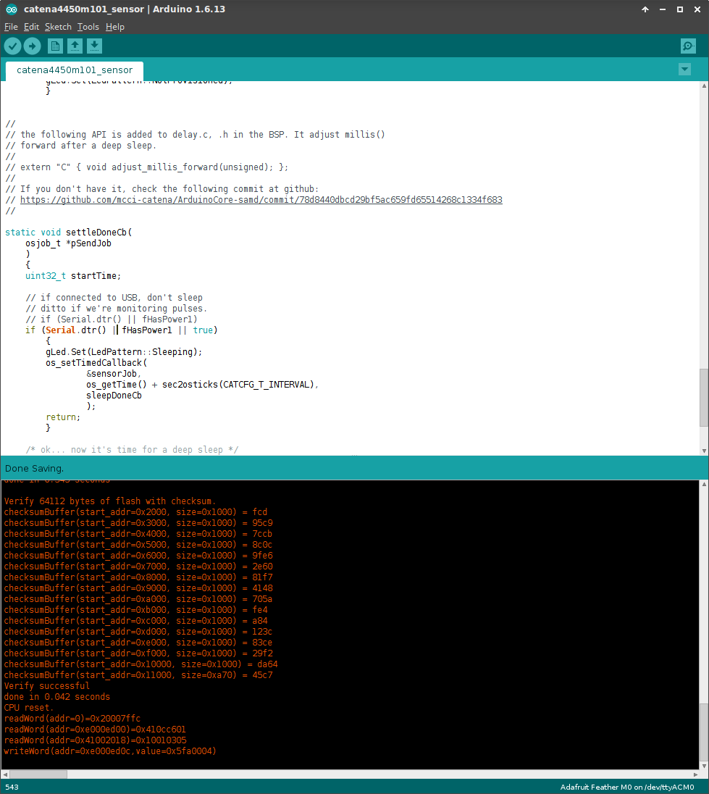
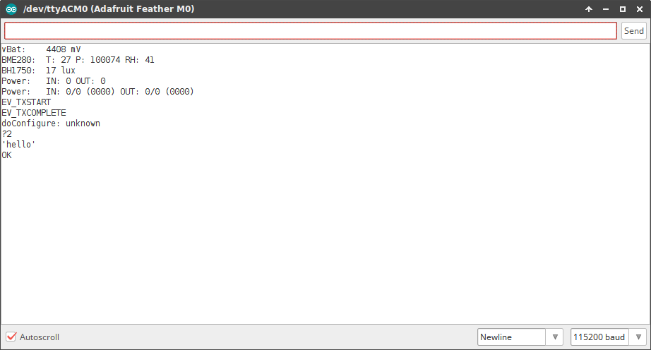
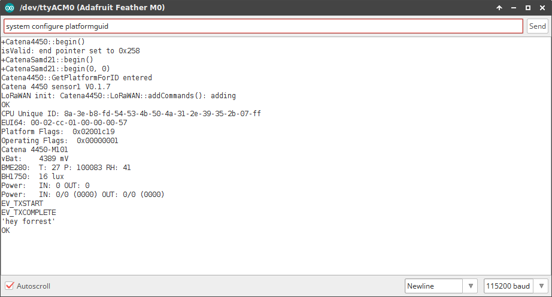
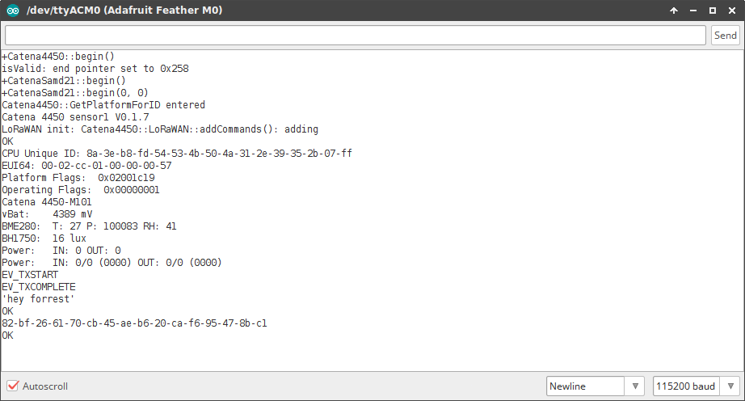
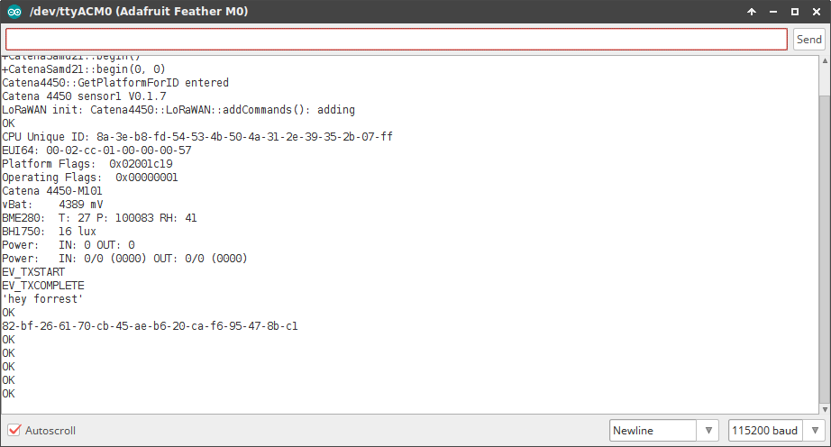

# MCCI-Catena4450-BSP

# MCCI Catena 4450
This repository contains Boards Manager file(.json) and the related packages for Arduino IDE.

The packages are compressed files(.zip) from [ArduinoCore-samd](https://github.com/mcci-catena/ArduinoCore-samd) repository.

In order to successfully build and upload/test the code to the Catena boards, please follow these steps:
- [Install Arduino IDE](#install-arduino-ide)
- [Install MCCI Catena BSP](#install-mcci-catena-4450-bsp)
- [Installing the Required MCCI Catena Libraries](#installing-the-required-mcci-catena-libraries)
    - [List of required libraries](#list-of-required-libraries)
- [Install the MCCI SAMD board support library](#install-the-mcci-samd-board-support-library)
- [Install Catena Drivers](#install-catena-drivers)
- [Build and Download](#build-and-download)
    - [Catena 4450 basic LED blink test](#catena-4450-basic-led-blink-test)
    - [Catena 4450 sensor and LoRaWAN configure test](#catena-4450-sensor-and-lorawan-configure-test)
    - [Disabling USB Sleep (Optional)](#disabling-usb-sleep-optional)

## Install Arduino IDE
Download the respective installer and install the latest release of Arduino IDE from [Arduino IDE](https://www.arduino.cc/en/Main/Software)

## Install MCCI Catena 4450 BSP
Start Arduino IDE and navigate to `File`>`Preferences` menu.


A follwing window will pop up.


A field named **Additional Boards Manager URLs:** is the place where we need to add the json files location. If more than one URL is needed, each URL is separated with a comma(`,`). New MCCI boards and updates to existing boards will automatically be picked up by the Board Manager each time it is opened. The URLs point to index files that the Board Manager uses to build the list of available & installed boards.

In this example, only MCCI board .json file URL will be added, but you can add multiple URLS by separating them with commas. 

Copy and paste the link below into the Additional Boards Manager URLs option in the Arduino IDE preferences.
`https://github.com/mcci-catena/arduino-boards/raw/master/BoardManagerFiles/package_mcci_index.json`


After adding the URL, go to `Tools`>`Board:`--->`Boards Manager...` and install MCCI Catena boards.


*note: type "mcci" on search bar and it'll list the MCCI Catena boards.*


*note: unlike certain BSPs, there’s no need to install the additional tools; this kit takes care of all that.*

## Installing the Required MCCI Catena Libraries
The script `git-boot.sh` in this directory will get all the things you need.

It's easy to run, provided you're on Windows, macOS, or Linux, and provided you have `git` installed. We tested on Windows with git bash from https://git-scm.org, on macOS 10.11.3 with the git and bash shipped by Apple, and on Ubuntu 16.0.4 LTS (64-bit) with the built-in bash and git from `apt-get install git`.

```shell
//Move to the location where you have saved git-boot.sh and git-repos.dat and run the following command
$ ./git-boot.sh
```

It has a number of advanced options; use `./git-boot.sh -h` to get help, or look at the source code [here](gitboot.sh).

**Beware of issue #18**.  If you happen to already have libraries installed with the same names as any of the libraries in `git-repos.dat`, `git-boot.sh` will silently use the versions of the library that you already have installed. (We hope to soon fix this to at least tell you that you have a problem.)

### List of required libraries

This sketch depends on the following libraries.

*  https://github.com/mcci-catena/Adafruit_FRAM_I2C
*  https://github.com/mcci-catena/Catena4410-Arduino-Library
*  https://github.com/mcci-catena/arduino-lorawan
*  https://github.com/mcci-catena/Catena-mcciadk
*  https://github.com/mcci-catena/arduino-lmic
*  https://github.com/mcci-catena/Adafruit_BME280_Library
*  https://github.com/mcci-catena/Adafruit_Sensor
*  https://github.com/mcci-catena/RTCZero
*  https://github.com/mcci-catena/BH1750
*  https://github.com/mcci-catena/Catena-Arduino-Platform

## Install the MCCI SAMD board support library

Go to `File>Preferences>Settings` in the Arduino IDE and add `https://github.com/mcci-catena/arduino-boards/raw/master/BoardManagerFiles/package_mcci_index.json` to the list in `Additional Boards Manager URLs`. Use a comma (`,`) to separate multiple entries if needed.

Next, open the board manager. `Tools>Board:...`, and get up to the top of the menu that pops out -- it will give you a list of boards. Search for `MCCI` in the search box and select `MCCI Catena SAMD Boards`. An `[Install]` button will appear to the right; click it.

Then go to `Tools>Board:...` and scroll to the bottom. You should see `Catena 4450`; select that.

## Install Catena Drivers
Catena board drivers for installation are under development and will be released shortly.
For time being please use the Arduino driver which supports MCCI Catena boards from C:\Program Files (x86)\Arduino\drivers (Windows OS)

### Procedure for installing the arduino driver
1. Go to Device Manager (Press Windows key + R, under run command type `devmgmt.msc`).
2. Under Device Manager, we can find Catena 4450 under `Other devices`.


3. Right click on Catena 4450 and select `Update Driver Software...`


4. Under How do you want to search option, Click the option `Browse my computer for driver software`.


5. For Browse for driver software option, select `Let me pick from a list of device drivers on my computer`.


6. Select device type `Ports (COM & LPT)`.


7. Click `Have disk`.


8. Copy the path `C:\Program Files (x86)\Arduino\drivers` browse field.


9. Select `Adafruit circuit playground` and give `Next`.


10. Driver will get install and the device could be seen under section `Ports` with port number.


## Build and Download

Shutdown the Arduino IDE and restart it, just in case.
Ensure selected board is 'Catena4450' (in the GUI, check that `Tools`>`Board: "..."` says `"Catena4450"`.


Select the respective COM port number on `Tools`>`Ports`.

### Catena 4450 basic LED blink test

For testing, you can choose `File`>`Examples`>`01.Basics`>`Blink`


Follow normal Arduino IDE procedures to build the sketch: `Sketch`>`Verify/Compile`.


and `Sketch`>`Upload`.


If the code builds and upload successfully, go on and test the other sketches for the boards.

### Catena 4450 sensor and LoRaWAN configure test

Clone/download the directory `catena4450m101sensor` and compile and upload the sketch.

### Disabling USB Sleep (Optional)
The `catena4450m101_sensor` sketch uses the SAMD "deep sleep" mode in order to reduce power. This works, but it's inconvenient in development. See **Deep Sleep and USB** under **Notes**, below, for a technical explanation. 

In order to keep the Catena from falling asleep while connected to USB, make the following change.

Search for
```
if (Serial.dtr() || fHasPower1)
```
and change it to
```
if (Serial.dtr() | fHasPower1 || true)
```


## Load the sketch into the Catena

Make sure the correct port is selected in `Tools`>`Port`. 

Load the sketch into the Catena using `Sketch`>`Upload` and move on to provisioning.

## Provision your Catena 4450
This can be done with any terminal emulator, but it's easiest to do it with the serial monitor (`Tools`>`Serial Monitor`) built into the Arduino IDE or with the equivalent monitor that's part of the Visual Micro IDE.

### Check platform provisioning



At the bottom righ side of the serial monitor window, set the dropdown to `Newline` and `115200 baud`.

Enter the following command, and press enter:
```
system configure platformguid
```
If the Catena is functioning at all, you'll either get an error message, or you'll get a long number like:
```
82BF2661-70CB-45AE-B620-CAF695478BC1
```
(Several numbers are possible.)





If you get an error message, please follow the **Platform Provisioning** instructions. Othewise, skip to **LoRAWAN Provisioning**.

### Platform Provisioning
The Catena 4450 has a number of build options. We have a single firmware image to support the various options. The firmware figures out the build options by reading data stored in the FRAM, so if the factory settings are not present or have been lost, you need to do the following.

If your Catena 4450 is fresh from the factory, you will need to enter the following commands.

`system configure syseui` _`serialnumber`_

You will find the serial number on the Catena 4450 assembly. If you can't find a serial number, please contact MCCI for assistance.

Continue by entering the following commands.
```
system configure operatingflags 1
system configure platformguid 82BF2661-70CB-45AE-B620-CAF695478BC1
```

### LoRaWAN Provisioning
If you're using The Things Network, go to https://console.thethingsnetwork.org and follow the instructions to add a device to your application. This will let you input the devEUI (we suggest using the serial number), and get the AppEUI and the Application Key. For other networks, follow their instructions for determining the devEUI and getting the AppEUI and AppKey.

Then enter the following commands in the serial monitor, substituting your _`DevEUI`_, _`AppEUI`_, and _`AppKey`_, one at a time.

`lorawan configure deveui` _`DevEUI`_  
`lorawan configure appeui` _`AppEUI`_  
`lorawan configure appkey` _`AppKey`_  
`lorawan configure join 0`

Close the serial monitor, disconnect the catena and reboot it once.

Now connect to the port and open serial monitor
`lorawan configure join 1`

After each command you will see an `OK`.



Now we can see the catena 4450 transmits data to the console for every 6 mins.
